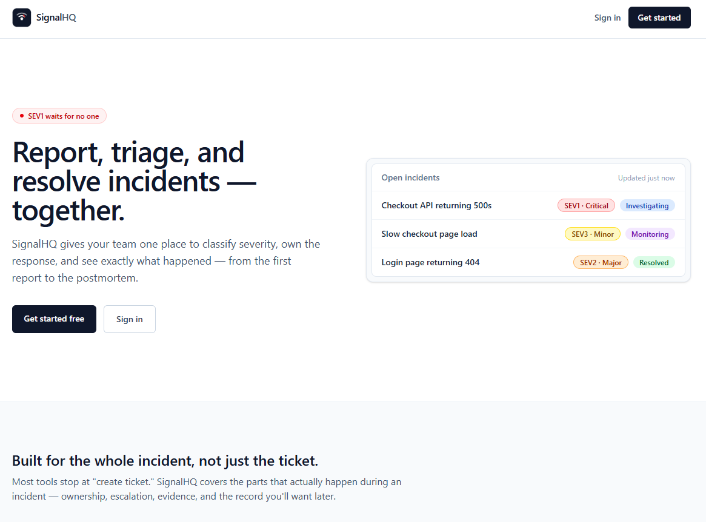
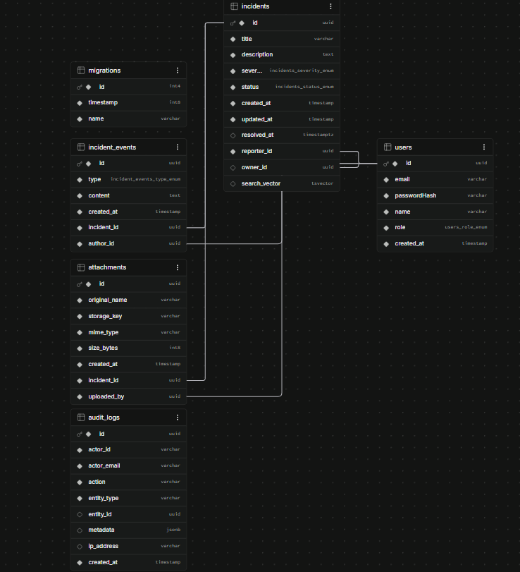

# SignalHQ

**Report, triage, and resolve production incidents — together.**

SignalHQ is a full-stack incident management platform built from scratch to demonstrate real, production-grade patterns across the whole stack: authentication, role-based access control, a modeled state machine, real-time updates, full-text search, and a proper audit trail — not just CRUD with a login screen bolted on.

This isn't a tutorial project stitched together from boilerplate. Every endpoint, every guard, every database migration was built, run, and verified by hand against a real Postgres instance and a real browser, with the bugs that came up along the way fixed rather than hidden.

---

## Table of contents

- [What it does](#what-it-does)
- [Tech stack](#tech-stack)
- [Architecture highlights](#architecture-highlights)
- [Project structure](#project-structure)
- [Getting started](#getting-started)
- [Environment variables](#environment-variables)
- [Database migrations](#database-migrations)
- [Testing](#testing)
- [How this was built](#how-this-was-built)
- [Design decisions worth knowing](#design-decisions-worth-knowing)
- [Known gaps / not yet built](#known-gaps--not-yet-built)
- [Roadmap ideas](#roadmap-ideas)

---

## What it does

SignalHQ covers the full lifecycle of a production incident, not just ticket creation:

- **Report** an incident with a title, description, and initial severity
- **Classify** severity (SEV1–SEV4) and **triage** status through a defined lifecycle
- **Assign ownership** — and require the actual owner (or an admin) to resolve it
- **Track everything** in a real-time, chronological timeline: every status change, severity change, comment, and file upload
- **Search** across every past incident with real full-text search, not a substring match
- **Audit** every security-relevant action — logins, role changes, escalations — separately from the incident timeline
- **See it live** — open the same incident in two browser tabs and watch changes propagate instantly via WebSocket

## Tech stack

| Layer | Technology | Why |
|---|---|---|
| **Frontend** | React 18 + TypeScript + Vite + Tailwind CSS v4 | Fast dev loop, strict typing shared conceptually with the backend, utility-first styling that stays consistent across every page |
| **Backend** | NestJS + TypeORM | Structured, testable modules; dependency injection makes RBAC guards and cross-cutting concerns (audit logging, real-time broadcasts) composable instead of duplicated |
| **Database** | PostgreSQL | Real full-text search (`tsvector` + GIN index + trigger), proper enum types, JSONB for audit metadata |
| **Real-time** | Socket.IO | Authenticated WebSocket gateway, room-per-incident broadcasting |
| **Auth** | JWT (short-lived) + bcrypt | Stateless auth suitable for a REST + WebSocket combination |

## Architecture highlights

These are the pieces of this project that go beyond "make the tests pass" and represent actual engineering decisions:

### 1. The incident lifecycle is a real state machine
Status transitions (`open → investigating → identified → monitoring → resolved → postmortem`) are validated by a single, dependency-free `IncidentStateMachine` class with unit tests covering every legal and illegal transition — not scattered `if` statements in a service. The frontend's dropdown mirrors the same transition map, but the backend is the actual enforcement point.

### 2. RBAC with two layers of authorization
- **Role-level**: a global `JwtAuthGuard` (secure by default, opt-out via `@Public()`) plus a per-route `RolesGuard` reading `@Roles(...)` metadata.
- **Instance-level**: resolving an incident requires being the *assigned owner* or an admin — a check that depends on data, not just the caller's role, so it lives in the service layer (`assertCanClose`) rather than being forced into a static decorator.

### 3. Two separate historical records, on purpose
- `IncidentEvent` — the **timeline**: what happened to this incident, read by a responder.
- `AuditLog` — the **security trail**: who did what across the whole system, read by an admin during a review. Deliberately denormalized (no foreign keys) so it survives deletion of the incident or user it references.

### 4. Real-time is push-only and server-authoritative
The Socket.IO gateway only ever pushes state after a mutation has committed to Postgres — clients never write over the socket. Every actual state change still goes through the same guarded REST endpoints, so RBAC enforcement lives in exactly one place.

### 5. Search that will still be fast at scale
Full-text search uses a Postgres `tsvector` column, maintained by a trigger (not recomputed in application code), backed by a GIN index — not `ILIKE '%term%'`, which can't use an index and degrades as the table grows.

## Project structure

```
SignalHQ/
├── backend/                          NestJS API
│   ├── src/
│   │   ├── auth/                     JWT strategy, guards, decorators, DTOs
│   │   ├── users/                    User entity, roster, role management
│   │   ├── incidents/                Core domain: entity, service, controller, state machine
│   │   ├── events/                   Incident timeline entries
│   │   ├── attachments/              File upload handling
│   │   ├── audit/                    Security audit log
│   │   ├── websocket/                Socket.IO gateway
│   │   ├── common/                   Shared enums
│   │   └── database/migrations/      Hand-reviewed TypeORM migrations
│   └── test/ (or colocated *.spec.ts) Unit tests
├── frontend/                         React SPA
│   └── src/
│       ├── api/                      Typed API client + per-resource calls
│       ├── components/               Badges, nav, modals, protected routes
│       ├── context/                  Auth context
│       ├── hooks/                    useIncidentSocket
│       ├── pages/                    Landing, auth, incident list/detail, admin
│       └── types/                    Shared domain types
└── README.md
```
### User Interface:


### Database:


## Getting started

### Prerequisites
- Node.js 20+
- PostgreSQL 16+ (or Docker to run it in a container)
- npm

### 1. Database

```bash
docker run --name signalhq-postgres \
  -e POSTGRES_USER=signalhq_app \
  -e POSTGRES_PASSWORD=change_me \
  -e POSTGRES_DB=signalhq \
  -p 5432:5432 \
  -d postgres:16-alpine
```

### 2. Backend

```bash
cd backend
npm install
cp .env.example .env   # fill in DB credentials and a JWT_SECRET
npm run migration:run
npm run start:dev       # http://localhost:3001
```

### 3. Frontend

```bash
cd frontend
npm install
cp .env.example .env    # point VITE_API_URL / VITE_WS_URL at the backend
npm run dev              # http://localhost:5173
```

### 4. Create your first admin

Registration always creates a `viewer` account (deliberately — see [Design decisions](#design-decisions-worth-knowing)). Promote yourself directly in Postgres:

```sql
UPDATE users SET role = 'admin' WHERE email = 'you@example.com';
```

Log out and back in — JWTs are short-lived (15 min), so a fresh login picks up the new role.

## Environment variables

**Backend (`backend/.env`)**

```
NODE_ENV=development
PORT=3001
DB_HOST=localhost
DB_PORT=5432
DB_USERNAME=signalhq_app
DB_PASSWORD=change_me
DB_NAME=signalhq
JWT_SECRET=<generate with: openssl rand -hex 64>
FRONTEND_URL=http://localhost:5173
```

**Frontend (`frontend/.env`)**

```
VITE_API_URL=http://localhost:3001
VITE_WS_URL=http://localhost:3001/incidents
```

## Database migrations

Schema changes are managed exclusively through TypeORM migrations — `synchronize` is always `false`. Every migration in this repo was generated, then manually reviewed line-by-line before being run, which is how several real bugs (missing `NOT NULL` constraints, a `DataTypeNotSupportedError` from an un-typed nullable column) were caught before they ever touched the database.

```bash
npm run migration:generate src/database/migrations/DescriptiveName
npm run migration:run
npm run migration:revert   # rolls back the most recent migration
```

## Testing

```bash
cd backend
npm run test
```

Current coverage focuses on the two pieces of logic most worth testing in isolation:
- `IncidentStateMachine` — every legal transition, illegal jumps, the terminal state, no-op transitions
- `RolesGuard` — access with/without required roles, with/without an authenticated user

## How this was built

This project was built incrementally, phase by phase, with a working, verified checkpoint at the end of each one — backend first, then frontend, wired to a backend that was already proven correct via direct HTTP/WebSocket testing before any UI touched it.

1. **NestJS + PostgreSQL connection** — proved the TypeORM connection worked before any real entity existed
2. **Auth & RBAC** — Role enum → User entity/migration → UsersService → JWT register/login → global auth guard → RolesGuard, each step curl-tested before the next began
3. **Incident domain core** — the state machine was written and unit-tested *before* any database or HTTP code touched it; then entity/migration, then CRUD, then status/severity transitions, then ownership enforcement
4. **Timeline** — every mutation from step 3 was retrofitted to also write a timeline event, in the same method, not bolted on separately
5. **Attachments** — Multer with an allow-list and randomized storage keys, verified with both an accepted upload and a rejected MIME type
6. **Audit logs** — a denormalized table wired into every mutating action across auth and incidents
7. **Real-time** — an authenticated Socket.IO gateway, tested with a throwaway Node script acting as a client before any frontend code existed
8. **Search, filtering, pagination** — a hand-written migration (trigger + tsvector + GIN index) reviewed before running, since TypeORM can't auto-generate a trigger
9. **Frontend** — scaffolded, then built page by page against the already-working backend: auth, incident list, incident detail, real-time updates, admin tooling, and finally a public landing page

Real bugs were hit and fixed along the way, including: a wrong relative import path, a module never wired into its parent's `imports` array (three separate times, across three different modules — a pattern worth watching for), an untyped nullable TypeORM column that Postgres rejected outright, a missing `esModuleInterop` flag, `synchronize: true` accidentally left on, and a CORS gap that only surfaced once a real browser (not curl) made the first request.

## Design decisions worth knowing

- **Password hashes are `select: false`** on the `User` entity — no ordinary query can accidentally leak a hash into an API response. The one path that needs it (`login`) explicitly opts in.
- **JWTs are short-lived (15 minutes)** and the role is trusted from the token itself, not re-fetched from the database on every request — a deliberate latency/staleness tradeoff, with the short TTL bounding how long a just-changed role stays stale.
- **Self-registration always lands as `viewer`.** There is no `role` field on the registration DTO at all — granting elevated access is a separate, explicit admin action, so there's no field for a client to smuggle a higher role through.
- **The same generic error** ("Invalid email or password") is returned whether the email doesn't exist or the password is wrong, to avoid leaking which accounts exist.
- **`ValidationPipe` uses `whitelist: true, forbidNonWhitelisted: true`** — any unexpected field in a request body is rejected outright, not silently dropped.

## Known gaps / not yet built

- No endpoint to list or download previously uploaded attachments (upload works; retrieval doesn't yet)
- No Docker / docker-compose setup for one-command startup
- No CI pipeline
- No dedicated postmortem editor for incidents in the terminal `postmortem` state
- No refresh-token flow — an expired session requires logging in again

## Roadmap ideas

- Attachment listing + secure download endpoints
- Docker Compose for Postgres + backend + frontend in one command
- GitHub Actions CI (lint, test, build) on every PR
- A structured postmortem document attached to resolved incidents
- Refresh token rotation instead of flat 15-minute sessions

---

Built as a from-scratch learning project — every phase run, tested, and debugged by hand rather than generated wholesale and trusted blind.
